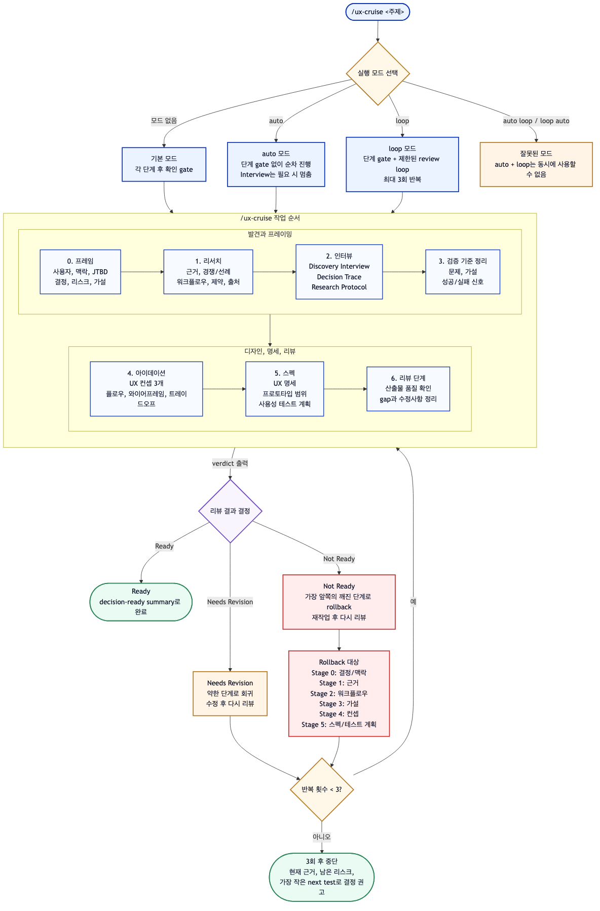

# CruiseUX

[English](https://github.com/letta-ai/mods/tree/main/packages/cruise-ux) | [한국어](https://github.com/letta-ai/mods/blob/main/packages/cruise-ux/README.ko.md)

CruiseUX는 UX/UI discovery 작업을 위한 Letta Code mod입니다. 의사결정 프레이밍, 리서치, Adaptive UX Interview, 아이데이션, UX specification, usability-test planning, decision-readiness review를 하나의 반복 가능한 흐름으로 정리합니다.

핵심 아이디어는 간단합니다.

> 질문을 테스트 가능한 프로토타입으로 바꾸고, 테스트된 프로토타입을 의사결정 가능한 근거로 바꾼다.

이 mod는 디자이너나 리서처를 대체하려는 도구가 아닙니다. 에이전트가 UX 작업을 할 때 리서치, 아이디어, 프로토타입, 테스트가 항상 **어떤 제품 결정을 돕기 위한 것인지** 잃지 않도록 레일을 만들어줍니다.

## 추가되는 명령어

| 명령어 | 목적 | 사용하기 좋은 상황 |
|---|---|---|
| `/ux-frame <topic>` | 사용자, 맥락, JTBD, 결정해야 할 것, 가설, 검증 기준, 최소 프로토타입 범위를 잡습니다. | 리서치나 아이데이션 전에 목표가 흐릿할 때 |
| `/ux-research <topic>` | evidence, assumptions, risks, open questions, source URLs가 포함된 UX research brief를 만듭니다. | 경쟁/워크플로우/기술/domain/compliance/platform 리서치가 필요할 때 |
| `/ux-interview <topic>` | Discovery Interview, Decision Trace, User Research Protocol 중 상황에 맞는 mode로 Adaptive UX Interview를 실행합니다. | 새 아이디어, 프로젝트 결정, 실제 사용자 리서치 계획을 명확히 해야 할 때 |
| `/ux-ideate <topic>` | hypothesis, failure signal, flow, tradeoff, ASCII wireframe이 포함된 3개 UX concept을 만듭니다. | 프로토타입 방향을 고르기 전에 여러 접근을 비교하고 싶을 때 |
| `/ux-spec <topic>` | prototype scope와 usability-test plan이 포함된 영어 UX specification을 만듭니다. | 구현/테스트 전에 공유 가능한 문서가 필요할 때 |
| `/ux-review <topic-or-path>` | 리서치/spec/prototype plan이 decision-ready한지 검토합니다. | 코딩, 테스트, 공유 전에 quality gate가 필요할 때 |
| `/ux-cruise [auto\|loop] <topic>` | 전체 decision-to-evidence pipeline을 실행합니다. | 처음부터 끝까지 UX 흐름을 진행하거나, 필요하면 수정 루프까지 돌리고 싶을 때 |

## Cruise pipeline

`/ux-cruise <topic>`은 아래 순서로 진행됩니다.

```text
Decision Frame
→ Research
→ Adaptive UX Interview
→ Problem + Hypothesis + Validation Frame
→ Ideation
→ UX Spec + Prototype/Test Plan
→ UX Review
```

기본 모드는 stage마다 확인 gate를 둡니다.

```text
/ux-cruise mobile checkout returns flow
```

`auto` 모드는 stage gate를 건너뜁니다. 단, interview 단계에서 사용자 답변이 필요하면 그대로 멈춥니다.

```text
/ux-cruise auto B2B onboarding permission setup
```

`loop` 모드는 gate 기반 pipeline에 review 이후 수정 루프를 추가합니다.

```text
/ux-cruise loop Data Matrix scan to wound capture flow
```

Loop mode 동작:

- `Ready` → 루프를 종료하고 decision-ready summary를 만듭니다.
- `Needs Revision` → 문제가 있는 특정 stage만 수정한 뒤 다시 review합니다.
- `Not Ready` → 단순 수정이 아니라 가장 앞쪽의 깨진 upstream stage로 rollback합니다.
- 최대 3회 반복합니다. 그 이후에는 현재 evidence, 남은 risk, 가장 작은 next test를 바탕으로 decision recommendation을 강제합니다.

`auto`와 `loop`는 의도적으로 동시에 사용할 수 없습니다.

```text
/ux-cruise auto loop <topic>  # invalid
/ux-cruise loop auto <topic>  # invalid
```

## 도식화 자료

`/ux-cruise` workflow 한눈에 보기:



[이미지가 보이지 않으면 PNG 직접 보기](./docs/diagrams/08-ux-cruise-balanced-flow-ko.png)

## 명령어 상세

### `/ux-frame <topic>`

넓게 리서치하거나 아이디어를 내기 전에, 작업을 decision 중심으로 정리합니다.

에이전트가 아래 내용을 잡도록 합니다.

- primary user
- context of use
- job-to-be-done
- decision needed
- known evidence
- assumptions
- risks
- testable UX hypotheses
- validation criteria
- smallest useful prototype

예시:

```text
/ux-frame field technician offline inspection flow
```

### `/ux-research <topic>`

구조화된 research brief를 만듭니다.

기대되는 섹션:

- Domain & Users
- Decision Needed
- Competitive Landscape
- User Workflow
- Technical / Regulatory Constraints
- Evidence
- Assumptions
- Risks
- Open Questions
- UX Implications

웹에서 얻은 claim은 source URL을 cite하도록 지시합니다.

구체적인 프로젝트가 있을 경우, durable research artifact를 아래에 보존하도록 지시합니다.

```text
<project>/docs/search/
```

예시:

```text
/ux-research AI writing assistant revision workflow
```

### `/ux-interview <topic>`

Adaptive UX Interview를 실행합니다. 에이전트는 topic과 현재 맥락을 보고 세 가지 mode 중 하나를 선택합니다. mode가 명확하면 바로 진행하고, 애매하면 mode 선택 질문 하나만 먼저 합니다.

| Mode | 언제 쓰는가 | 결과물 |
|---|---|---|
| **Discovery Interview** | 아이디어가 새롭거나 넓고, 아직 맥락이 부족할 때 | Discovery Brief: 사용자, 상황, 현재 workaround, friction, 원하는 결과, constraints, success signal |
| **Decision Trace** | 이미 프로젝트 맥락이 있고, 다음 prototype/spec/test 결정을 명확히 해야 할 때 | Decision Trace Brief + Validation Contract: workflow trace, decisions, assumptions, risks, test-later items, success/failure signals |
| **User Research Protocol** | 실제 참여자에게 물어볼 질문, task, usability-test script가 필요할 때 | Research / Usability Test Protocol: objective, participant profile, non-leading questions, task missions, data capture, analysis plan |

질문은 쉬운 말로 해야 합니다. 내부 방법론 용어를 사용자가 묻기 전까지 드러내지 않습니다. 예를 들어 “decision blocker”라고 묻기보다 아래처럼 묻습니다.

```text
이번 프로토타입으로 가장 먼저 무엇을 결정하고 싶나요?
```

Decision Trace는 업계 표준 방법론이라고 주장하지 않습니다. 이 mod 안에서 사용하는 실무 workflow이며, task analysis, cognitive walkthrough-style step reasoning, assumption mapping, hypothesis-driven design, lightweight decision logging을 조합합니다.

예시:

```text
/ux-interview team dashboard alert triage workflow
```

### `/ux-ideate <topic>`

서로 다른 UX concept 3개를 생성합니다. 단순히 스타일만 다른 안이 아니라 interaction paradigm, information density, entry point, device posture, automation/confirmation model이 달라야 합니다.

각 concept은 아래를 포함해야 합니다.

- name
- core idea
- hypothesis
- what the prototype validates
- failure signal
- user flow
- ASCII wireframe
- strengths
- weaknesses
- best-fit context

예시:

```text
/ux-ideate subscription cancellation recovery flow
```

### `/ux-spec <topic>`

공유 가능한 영어 UX specification을 합성합니다.

기대되는 섹션:

1. Overview
2. Evidence, Assumptions, and Open Questions
3. UX Hypotheses
4. User Scenarios
5. Validation Criteria
6. Edge Cases & Error States
7. ASCII Wireframes
8. Prototype Plan
9. Usability Test Plan
10. Constraints & Non-Goals
11. Decision Recommendation

구체적인 프로젝트가 있을 경우, spec은 아래에 저장하도록 제안합니다.

```text
<project>/docs/plans/
```

예시:

```text
/ux-spec B2B admin role-permission setup
```

### `/ux-review <topic-or-path>`

UX artifact 또는 현재 대화 맥락이 decision-ready한지 검토합니다.

코딩, 테스트, 공유 전에 사용하는 check command입니다.

파일 경로 예시:

```text
/ux-review docs/plans/v1-dashboard-alert-triage.md
```

주제 기반 예시:

```text
/ux-review mobile checkout return-flow test plan before prototype changes
```

검토 기준:

- decision needed가 명확한가
- user, context, job-to-be-done이 명확한가
- evidence, assumptions, risks, open questions가 분리되어 있는가
- UX hypotheses가 testable한가
- validation criteria가 관찰 가능한 행동이나 evidence와 연결되어 있는가
- flow와 interaction model이 visual polish 전에 이해 가능한가
- edge/error/recovery state가 포함되어 있는가
- prototype scope가 가장 작은 testable scope인가
- usability test plan이 behavioral data와 qualitative feedback을 수집하는가
- decision threshold가 proceed/revise/reject 기준을 말하는가
- 파일 저장 경로가 명확한가

Verdict는 아래 중 하나입니다.

```text
Ready | Needs Revision | Not Ready
```

## Help

각 명령어는 command별 help를 제공합니다.

```text
/ux-frame help
/ux-research help
/ux-interview help
/ux-ideate help
/ux-spec help
/ux-review help
/ux-cruise help
```

## 설치

Letta Code에서 published package를 설치합니다.

```bash
letta install npm:@letta-ai/cruise-ux
```

그 다음 Letta Code 세션에서 reload합니다.

```text
/reload
```

명령어가 보이는지 확인합니다.

```text
/ux-cruise help
```

이 repository에서 local development 용도로 설치하려면:

```bash
git clone https://github.com/letta-ai/mods.git
letta install ./mods/packages/cruise-ux
```

## 개발

패키지 검사를 실행합니다.

```bash
npm run check
```

검사 항목:

- `package.json#letta` 존재 여부
- 선언된 mod 파일 존재 여부
- `MOD.md` frontmatter의 `name`, `description`
- mod source syntax check

## Acknowledgements

`/ux-interview`의 Discovery Interview mode는 [gajae-code](https://github.com/Yeachan-Heo/gajae-code)의 deep-interview workflow에서 영감을 받아 UX/UI discovery와 prototype planning에 맞게 조정했습니다. CruiseUX는 gajae-code source code를 복사하지 않고, 별도의 Letta Code mod 구현을 사용합니다.

## Safety

Mods는 사용자의 로컬 권한으로 실행되는 trusted local code입니다. third-party package를 설치하기 전에 source를 검토하세요.

이 package는 slash command만 등록합니다. 자체적으로 filesystem write, network call, timer, startup side effect를 수행하지 않습니다. 다만 생성된 prompt에 따라 현재 agent가 정상 도구를 사용할 수는 있습니다.

mod가 startup이나 command handling을 깨뜨리면 아래처럼 복구할 수 있습니다.

```bash
letta --no-mods
# or
LETTA_DISABLE_MODS=1 letta
```

그 다음 mod를 제거/수정하고 `/reload`를 실행하세요.

Agent-facing behavioral contract는 MOD.md를 참고하세요.
