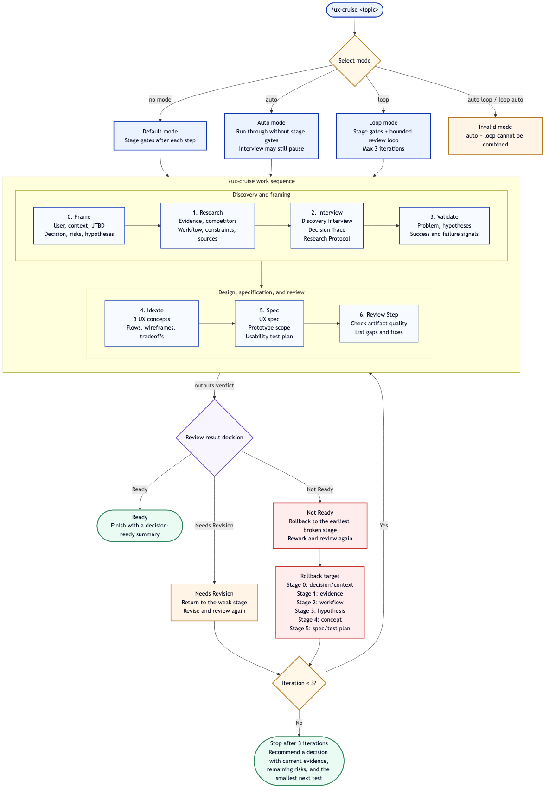

# CruiseUX

[English](https://github.com/letta-ai/mods/tree/main/packages/cruise-ux) | [한국어](https://github.com/letta-ai/mods/blob/main/packages/cruise-ux/README.ko.md)

CruiseUX is a Letta Code mod package that guides agents through UX/UI discovery work: decision framing, research, adaptive UX interviews, ideation, UX specification, usability-test planning, and decision-readiness review.

The core idea is simple:

> Turn questions into tested prototypes, and tested prototypes into decision-ready evidence.

This mod does not try to replace a designer or researcher. It gives an agent a repeatable UX rail so research, ideas, prototypes, and tests stay tied to the product decision they are supposed to support.

## What it adds

| Command | Purpose | Best used when |
|---|---|---|
| `/ux-frame <topic>` | Frames user, context, job-to-be-done, decision, hypotheses, validation criteria, and smallest useful prototype | The work is fuzzy and needs a decision target before research or ideation |
| `/ux-research <topic>` | Produces a structured UX research brief with evidence, assumptions, risks, open questions, and source URLs | You need competitive, workflow, technical, domain, compliance, or platform research |
| `/ux-interview <topic>` | Runs an adaptive UX interview with Discovery Interview, Decision Trace, or User Research Protocol mode | You need to clarify a new idea, a project decision, or a real-user research plan |
| `/ux-ideate <topic>` | Generates three distinct UX concepts with hypotheses, failure signals, flows, tradeoffs, and ASCII wireframes | You need multiple interaction approaches before picking a prototype direction |
| `/ux-spec <topic>` | Synthesizes an English UX specification with prototype scope and usability-test plan | You need a shared artifact before building or testing |
| `/ux-review <topic-or-path>` | Reviews research/spec/prototype plans for decision-readiness | You want a check before coding, testing, or sharing a plan |
| `/ux-cruise [auto\|loop] <topic>` | Runs the full decision-to-evidence pipeline | You want the agent to move through the whole UX workflow, optionally with a revision loop |

## Cruise pipeline

`/ux-cruise <topic>` runs this sequence:

```text
Decision Frame
→ Research
→ Adaptive UX Interview
→ Problem + Hypothesis + Validation Frame
→ Ideation
→ UX Spec + Prototype/Test Plan
→ UX Review
```

Default mode uses confirmation gates between stages:

```text
/ux-cruise mobile checkout returns flow
```

Auto mode skips stage gates, but the interview stage still pauses when user answers are needed:

```text
/ux-cruise auto B2B onboarding permission setup
```

Loop mode keeps the pipeline gated and adds a bounded revision loop after review:

```text
/ux-cruise loop Data Matrix scan to wound capture flow
```

Loop mode behavior:

- `Ready` → stop and produce a decision-ready summary.
- `Needs Revision` → revise the specific weak stage, then re-review.
- `Not Ready` → roll back to the earliest broken upstream stage, then re-review.
- Maximum 3 iterations. After that, force a decision recommendation with the current evidence, remaining risks, and smallest next test.

`auto` and `loop` are intentionally mutually exclusive:

```text
/ux-cruise auto loop <topic>  # invalid
/ux-cruise loop auto <topic>  # invalid
```

## Diagrams

The `/ux-cruise` workflow at a glance:



[Open the PNG directly](./docs/diagrams/07-ux-cruise-balanced-flow.png)

## Command details

### `/ux-frame <topic>`

Creates a compact decision frame before doing broader work.

It asks the agent to define:

- primary user
- context of use
- job-to-be-done
- decision needed
- known evidence
- assumptions
- risks
- testable UX hypotheses
- validation criteria
- smallest useful prototype

Example:

```text
/ux-frame field technician offline inspection flow
```

### `/ux-research <topic>`

Creates a structured research brief.

Expected sections:

- Domain & Users
- Decision Needed
- Competitive Landscape
- User Workflow
- Technical / Regulatory Constraints
- Evidence
- Assumptions
- Risks
- Open Questions
- UX Implications

The prompt tells the agent to cite source URLs for web-sourced claims.

For concrete projects, it also tells the agent to preserve durable research artifacts under:

```text
<project>/docs/search/
```

Example:

```text
/ux-research AI writing assistant revision workflow
```

### `/ux-interview <topic>`

Runs an Adaptive UX Interview. The agent chooses one of three modes based on the topic and current context. If the mode is obvious, it states the mode and proceeds. If not, it asks one mode-selection question.

| Mode | Use when | Output |
|---|---|---|
| **Discovery Interview** | The idea is new, broad, or thinly defined | Discovery Brief: user, situation, current workaround, friction, desired outcome, constraints, success signal |
| **Decision Trace** | Project context already exists and the next prototype/spec/test decision needs clarification | Decision Trace Brief + Validation Contract: workflow trace, decisions, assumptions, risks, test-later items, success/failure signals |
| **User Research Protocol** | You need questions, tasks, or a usability-test script for real participants | Research / Usability Test Protocol: objective, participant profile, non-leading questions, task missions, data capture, analysis plan |

The command uses plain-language questions. It should not expose method jargon unless the user asks. For example, instead of asking about a “decision blocker,” it should ask:

```text
What should this prototype help you decide first?
```

Decision Trace is not a claimed industry-standard method. It is a practical workflow in this mod that combines task analysis, cognitive walkthrough-style step reasoning, assumption mapping, hypothesis-driven design, and lightweight decision logging.

Example:

```text
/ux-interview team dashboard alert triage workflow
```

### `/ux-ideate <topic>`

Generates three distinct concepts. Each concept should include:

- name
- core idea
- hypothesis
- what the prototype validates
- failure signal
- user flow
- ASCII wireframe
- strengths
- weaknesses
- best-fit context

Example:

```text
/ux-ideate subscription cancellation recovery flow
```

### `/ux-spec <topic>`

Synthesizes a shared English UX specification.

Expected sections:

1. Overview
2. Evidence, Assumptions, and Open Questions
3. UX Hypotheses
4. User Scenarios
5. Validation Criteria
6. Edge Cases & Error States
7. ASCII Wireframes
8. Prototype Plan
9. Usability Test Plan
10. Constraints & Non-Goals
11. Decision Recommendation

For concrete projects, the agent should offer to save the spec under:

```text
<project>/docs/plans/
```

Example:

```text
/ux-spec B2B admin role-permission setup
```

### `/ux-review <topic-or-path>`

Reviews an artifact or current conversation for decision-readiness.

Use it before coding, testing, or sharing a plan.

Example with a file path:

```text
/ux-review docs/plans/v1-dashboard-alert-triage.md
```

Example with a topic:

```text
/ux-review mobile checkout return-flow test plan before prototype changes
```

Review rubric:

- decision needed is explicit
- user, context, and job-to-be-done are clear
- evidence, assumptions, risks, and open questions are separated
- UX hypotheses are testable
- validation criteria are tied to observable behavior or evidence
- flows and interaction model are understandable before visual polish
- edge/error/recovery states are covered
- prototype scope is the smallest useful testable scope
- usability test plan captures behavioral data and qualitative feedback
- decision threshold says what evidence is enough to proceed, revise, or reject
- artifact save paths are clear when files should be written

Verdict format:

```text
Ready | Needs Revision | Not Ready
```

## Help

Each command has command-specific help:

```text
/ux-frame help
/ux-research help
/ux-interview help
/ux-ideate help
/ux-spec help
/ux-review help
/ux-cruise help
```

## Installation

Install the published package from Letta Code:

```bash
letta install npm:@letta-ai/cruise-ux
```

Then reload active Letta Code sessions:

```text
/reload
```

Verify commands are available:

```text
/ux-cruise help
```

For local development from this repository:

```bash
git clone https://github.com/letta-ai/mods.git
letta install ./mods/packages/cruise-ux
```

## Development

Run the package check:

```bash
npm run check
```

The check verifies:

- `package.json#letta` exists
- declared mod files exist
- `MOD.md` frontmatter includes `name` and `description`
- mod source syntax check

## Acknowledgements

The Discovery Interview mode in `/ux-interview` is inspired by the deep-interview workflow from [gajae-code](https://github.com/Yeachan-Heo/gajae-code), adapted for UX/UI discovery and prototype planning. CruiseUX does not copy gajae-code source code; it uses a separate Letta Code mod implementation.

## Safety

Mods are trusted local code. Review the source before installing third-party mods.

This package registers slash commands only. It does not perform filesystem writes, network calls, timers, or startup side effects by itself. The active agent may still choose to use its normal tools in response to the generated prompts.

If a mod breaks startup or command handling, recover with:

```bash
letta --no-mods
# or
LETTA_DISABLE_MODS=1 letta
```

Then remove or edit the mod package and run `/reload`.

See MOD.md for the agent-facing behavioral contract.
